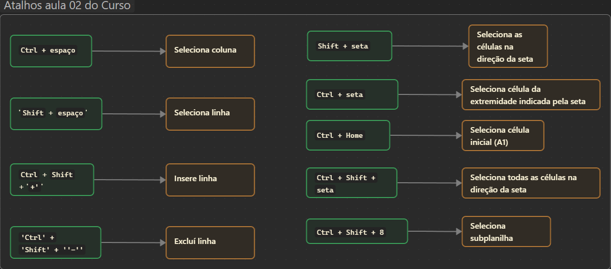

# 📊 Curso Introdutório de Excel — Projeto Complementar do TCC em Logística

Bem-vindo(a) ao repositório do **Curso Introdutório de Excel**, desenvolvido como parte das **horas complementares** do meu **Trabalho de Conclusão de Curso (TCC)** em **Logística**.

Este repositório tem como objetivo **comprovar a realização do curso** e **organizar as anotações** feitas ao longo do aprendizado, relacionando o conteúdo estudado com o projeto principal do TCC.

---

## 🧠 Contexto do Projeto

A importância deste curso está **diretamente ligada aos objetivos do artigo do TCC**, pois foi necessário **revisar e evidenciar conceitos introdutórios de Excel** para o **desenvolvimento da proposta de intervenção** — voltada à **gestão de estoques e tecnologias de baixo custo** aplicadas à microempresa *Moça Bonita*.

---

## 📂 Estrutura do Repositório
📦 Curso-excel/
├── 📘 README.md
├── 📁 Planilhas/
│ └── curso-excel.xlsx
├── 🗒️ Anotacoes_Obsidian/
│ ├── 01_surgimento-das-planilhas.md
│ ├── 02_atalhos-excel.canvas
│ └── ...
└── 📷 Imagens/
├── curso-guanabara.png
├── planilha-exemplo.png
└── ...

> 🧩 *A pasta `Anotacoes_Obsidian` contém anotações exportadas do Obsidian — com conceitos, exercícios e observações feitos durante o curso.*

---

## 🎓 Curso Utilizado

📺 **Curso de Excel — Gustavo Guanabara (Curso em Vídeo)**
Uma introdução prática e acessível aos principais recursos da ferramenta.

🔗 [Acessar o curso completo](https://www.cursoemvideo.com/curso/excel/)

---

## 📸 Galeria de Imagens

Aqui estão alguns registros do andamento do curso e das planilhas criadas:

| 📘 Aula | 🖼️ Imagem |
|---------|------------|
| Introdução ao Excel |  |
| Funções básicas |  |
| Anotações no Obsidian |  |

> 💡 As imagens acima podem ser substituídas por capturas reais após o término do curso.
> Basta colocar os arquivos `.png` ou `.jpg` na pasta `/Imagens` e atualizar o nome no README.

---

## 🧾 Como visualizar as anotações do Obsidian

1. Baixe a pasta `Anotacoes_Obsidian/` deste repositório.
2. Abra o **Obsidian** → clique em **"Open folder as vault"**.
3. Selecione a pasta baixada.

> ✍️ *As notas contêm explicações e exercícios sobre funções, gráficos e fórmulas aplicadas à logística.*

---

## 🧰 Ferramentas e Tecnologias

| Ferramenta | Uso Principal |
|-------------|----------------|
| 💻 **Microsoft Excel** | Criação de planilhas e exercícios |
| 🪶 **Obsidian** | Registro e organização das anotações |
| 🧩 **GitHub** | Versionamento e comprovação da realização do curso |

---

## 📅 Status do Projeto

🚧 **Em desenvolvimento**
As planilhas, prints e anotações finais serão adicionadas conforme o andamento do curso.

---

## ✍️ Autor

**Henrique de Melo Rodrigues**
🎓 Estudante de Logística — *Trabalho de Conclusão de Curso (TCC)*
📍 *Logística de Estoque — Moda Feminina, Cubatão/SP, 2025*

---

## 📜 Licença

Este repositório é de uso **acadêmico e pessoal**, voltado à comprovação de horas complementares e ao desenvolvimento do TCC.

---

⭐ *Se gostou da estrutura, deixe uma estrela no repositório!*
